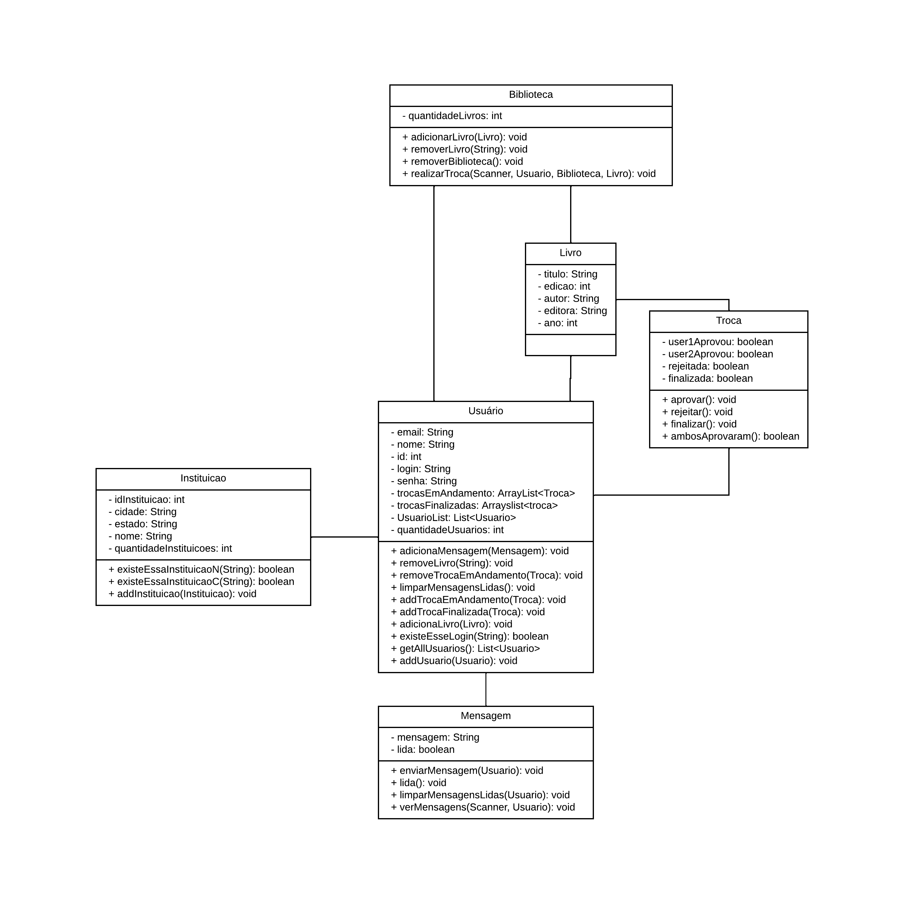
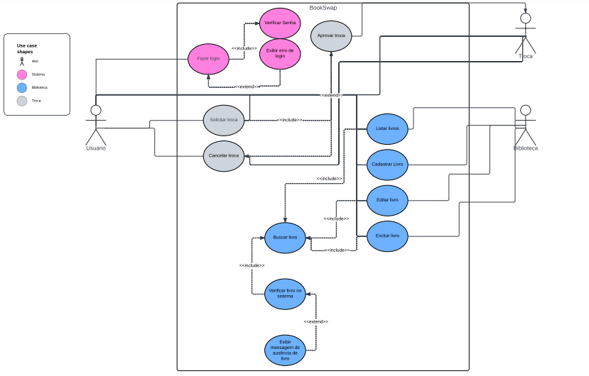

# Sumário

- [Sumário](#sumário)
  - [Definição do Projeto](#definição-do-projeto)
    - [Descrição](#descrição)
    - [Perfil do Usuário](#perfil-do-usuário)
  - [Documento de Requisitos](#documento-de-requisitos)
    - [Introdução](#introdução)
    - [Requisitos Funcionais](#requisitos-funcionais)
      - [Cadastro de Usuário](#cadastro-de-usuário)
      - [Login](#login)
      - [Perfil do Usuário](#perfil-do-usuário-1)
      - [Edição de dados do Perfil do Usuário](#edição-de-dados-do-perfil-do-usuário)
      - [Listagem de Livros](#listagem-de-livros)
      - [Solicitação de Troca](#solicitação-de-troca)
      - [Historico de trocas](#historico-de-trocas)
      - [Enviar mensagens](#enviar-mensagens)
      - [Apagar mensagens](#apagar-mensagens)
      - [Historico de mensagens](#historico-de-mensagens)
      - [Adicionar livros da biblioteca pessoal](#adicionar-livros-da-biblioteca-pessoal)
      - [Remover livros da biblioteca pessoal](#remover-livros-da-biblioteca-pessoal)
    - [Requisitos de Qualidade](#requisitos-de-qualidade)
      - [Instituições parceiras](#instituições-parceiras)
      - [Comunicabilidade](#comunicabilidade)
      - [Testes e Garantia de Qualidade](#testes-e-garantia-de-qualidade)
    - [Considerações Finais](#considerações-finais)
  - [Diagrama de classes](#diagrama-de-classes)
  - [Diagrama de casos de uso](#diagrama-de-casos-de-uso)
  - [Atividades de teste a serem empregadas](#atividades-de-teste-a-serem-empregadas)
  - [Desenvolvedores](#desenvolvedores)
  - [Licença](#licença)

## Definição do Projeto  

### Descrição 

O **BookSwap Universitário** é um aplicativo digital desenvolvido em `java` pelo time composto por Jhoan, Caue e Dayverson, projetado para facilitar o compartilhamento de conhecimento entre estudantes universitários no Brasil. O objetivo principal é resolver um desafio comum enfrentado pelos alunos: a gestão econômica e eficiente dos materiais didáticos. A plataforma permite que os usuários troquem livros ociosos por livros que lhes interessem, promovendo não apenas a economia entre os estudantes, mas também uma comunidade de aprendizado colaborativo.

### Perfil do Usuário

O público-alvo da BookSwap Universitário é composto por estudantes universitários entre 18 e 35 anos, independentemente do gênero, localização geográfica ou área de estudo. Esses usuários possuem um nível moderado a avançado de proficiência tecnológica, estão familiarizados com aplicativos móveis e plataformas _on-line_, e são ativos em redes sociais. Eles enfrentam desafios financeiros durante sua jornada acadêmica e buscam soluções econômicas para otimizar seus recursos.

## Documento de Requisitos 

### Introdução

O Documento de Requisitos descreve os requisitos funcionais e de qualidade para o desenvolvimento do **BookSwap Universitário**, uma plataforma digital projetada para facilitar o compartilhamento de livros entre estudantes universitários.

### Requisitos Funcionais

#### Cadastro de Usuário

- Os usuários devem poder se cadastrar na plataforma fornecendo informações básicas como nome, e-mail, login, instituição de ensino, senha.

#### Login

- Os usuários devem poder fazer login na plataforma fornecendo seu login e senha previamente cadastrados para acessar suas contas e funcionalidades personalizadas.

#### Perfil do Usuário

- Cada usuário terá um perfil pessoal onde poderá visualizar seus dados pessoais.

#### Edição de dados do Perfil do Usuário

- Os usuários devem poder editar informações de perfil, garantindo controle sobre suas informações pessoais na plataforma.

#### Listagem de Livros

- Os usuários devem poder ver os livros da sua lista de troca, incluindo detalhes como título, autor, etc.

#### Solicitação de Troca

- Deve existir um mecanismo que permita aos usuários solicitar a troca de livros com outros usuários.

#### Historico de trocas

- Os usuários devem poder acessar um histórico de todas as trocas realizadas por ele na plataforma.

#### Enviar mensagens

- Os usuários devem poder enviar mensagens uns aos outros para discutir detalhes de trocas.

#### Apagar mensagens

- Os usuários devem ter a capacidade de apagar as mensagens que enviaram apenas para si mesmo.

#### Historico de mensagens

- Deve existir um histórico de todas as mensagens enviadas entre usuários.

#### Adicionar livros da biblioteca pessoal

- Os usuários devem poder adicionar livros de sua biblioteca pessoal na plataforma.

#### Remover livros da biblioteca pessoal

- Os usuários devem poder remover livros de sua biblioteca pessoal na plataforma.

### Requisitos de Qualidade

#### Instituições parceiras

- Só é possível se cadastrar se você for de uma instituição parceira do app.

#### Comunicabilidade

- Sistema de comunicação entre usuários que estão fazendo uma troca, incluindo mensagens diretas.

#### Testes e Garantia de Qualidade

- Realização de testes para identificar e corrigir bugs, garantindo estabilidade e confiabilidade.

### Considerações Finais

Este Documento de Requisitos delineia os requisitos funcionais e de qualidade para o desenvolvimento do BookSwap Universitário. Esses requisitos devem ser considerados durante todo o processo de desenvolvimento para garantir que a plataforma atenda às necessidades dos usuários e ofereça uma experiência satisfatória.

## Diagrama de classes

## Diagrama de casos de uso

## Atividades de teste a serem empregadas

**Teste de Unidade:**
- Verificar individualmente cada componente do sistema para garantir que eles funcionem conforme o esperado.

**Teste de Integração:**
- Testar a integração entre os diferentes módulos do sistema para garantir que funcionem harmoniosamente junto.

**Teste de Sistema:**
- Testar o sistema como um todo para verificar se todas as partes integradas funcionam corretamente e atendem aos requisitos do sistema.

**Análise do Valor Limite:**
- Identificar e testar os valores limites dentro das faixas permitidas para entrada de dados, a fim de verificar se o sistema se comporta corretamente próximo aos limites de suas especificações.

**Error Guessing:**
- Utilizar experiência, intuição e conhecimento geral para antecipar e testar cenários de erro que podem ocorrer durante a execução do sistema.

## Desenvolvedores

- Jhoan Fernandes de Oliveira
- Claudio Caueh Oliveira Xavier
- Dayvison Eryc de Moura Silva

## Licença

Este projeto é distribuído sob a licença MIT. Veja o arquivo `LICENSE` para mais detalhes.
